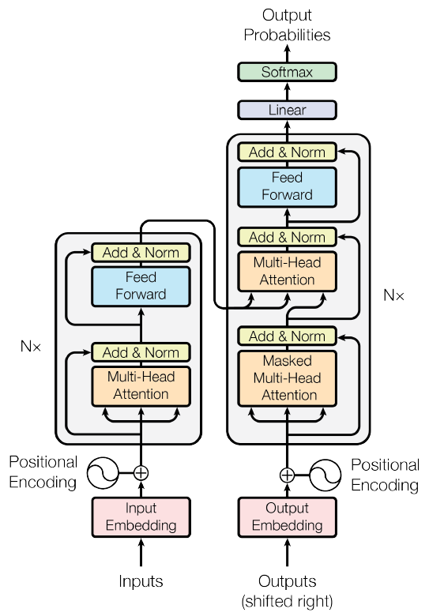

# Attention Is All You Need

## 摘要

&emsp;&emsp;主流的序列转换模型是基于复杂的循环或卷积神经网络模型，这些神经网络包含一个编码器和一个解码器。表现最好的模型也通过attention机制连接编码解码器。我们提出了一个新的简单的网络架构，Transformer，仅基于attention机制，完全摒弃了循环和卷积。在两个机器翻译任务的实验上表明，新的模型在翻译质量高优越，同时更易于并行化，而且需要更少的时间进行训练。我们的模型在WMT 2014 English-to-German 翻译任务上的BLEU值达到了28.4，超过目前最好的结果（包括整合模型）2个BLEU。在WMT 2014 English-to-French翻译任务上，我们的模型建立了一个新的单模型最先进的BLEU分数41.8，它在8块GPU上训练了3.5天，这是文献记载中最好模型训练成本中的一小部分。我们展示了Transformer对其他任务泛化性能良好，通过在大数据集和有限数据集两种训练数据下将其成功应用在English constituency parsing。

## 1 简介

&emsp;&emsp;在序列建模和transduction问题上，例如语言建模和机器翻译[35,2,5]，循环神经网络，特别是LSTM[13]和GRU[7]，已经被确立为最先进的方法。自此以后的许多努力都在致力于推动循环语言模型和encoder-decoder结构[38,24,15]的边界。

&emsp;&emsp;循环模型通常是将输入输出序列的符号位置作为因素计算。通过在计算的时候对齐位置和步骤，他们根据前一步的隐藏层状态ht-1和输入产生位置t的隐藏状态序列ht。这个固有的顺序性质妨碍了训练样本的并行化，这在更长的序列中至关重要，因为内存的约束限制了样本的批次大小。最近的工作通过因式分解[21]和条件计算[32]大幅提升了计算效率，同时后者也提升了模型的性能。然而，最基础的顺序计算的约束仍然存在。

&emsp;&emsp;在多种任务中，Attention机制已经成为序列建模和转导模型不可或缺的一部分，它可以建模序列中的依赖关系而不考虑他们在输入或输出序列[2,19]中的距离。除少数情况外[27]，这些Attention机制都和循环神经网络一起使用。

&emsp;&emsp;在本次工作中，我们提出了Transformer，一个避开了循环的模型架构，完全依赖于Attention机制抽取输入和输出之间的全局依赖。Transformer允许进行大量的更多的并行化，而且在八块P100 GPUs上训练至少12小时后，可以达到一个新的最佳的翻译质量。

## 2 背景

&emsp;&emsp;减少顺序计算的目标也是构建扩展神经GPU[16]，ByteNet[18]和ConvS2S[9]的基础，它们都使用卷积神经网络作为基础模块，并行计算所有输入和输出位置的隐藏层表示。在这些模型中，关联任意两个输入或输出之间的信号所需要的操作数量会随这两个位置间的距离增长，对于ConvS2S是线性增长，而对于ByteNet是成对数增长。这使学习两个远距离位置[12]之间的依赖更加困难。在Transformer中，操作数量将减少到常数。尽管由于对Attention的权重取平均的代价降低了效果，但是我们将使用Multi-Head Attention来抵消这个影响，具体见3.2章节。

&emsp;&emsp;Self-Attention，有时也称为intra-attention，是一个Attention机制通过关联单序列的不同位置来计算一个序列的表达。Self-Attention成功应用在不同任务中，包括阅读理解，摘要生成，文本蕴含和学习任务无关句子的表征[4,27,28,22]。

&emsp;&emsp;End-to-end的记忆网络（memory networks）是基于Attention机制的循环，而不是序列对齐的循环，而且在单语问答和语言建模任务[34]中表现良好。

&emsp;&emsp;据我们所知，Transformer是第一个完全依赖于self-attention来计算他的输入和输出的表达而没有使用序列对齐RNN或卷积的转导模型。在下列章节中，我们将会详细叙述Transformer，引出self-attention，并讨论它相对于[17,18]和[9]的优势。

## 3 模型架构

 

Figure 1: The Transformer - model architecture.

&emsp;&emsp;大多数神经序列转导模型有一个encoder-decoder结构[5,2,35]。这里，encoder将符号表示的输入序列(x1 ,..., xn)映射到一个连续的表示序列z = (z1, ..., zn)。根据z，decoder生成一个符号表示的输出序列(y1, ..., yn)，一次一个元素。每一步模型都是自回归的[10]，当生成下一个元素时，消耗先前生成的符号作为额外的输入。

&emsp;&emsp;Transformer遵循这种整体架构，encoder和decouder都使用堆叠的selfattention和point-wise，全连接层，分别显示在图1的左右。

### 3.1 编码器和解码器的堆栈

**Encoder:**	编码器由N = 6个完全相同的层堆成。每一层有两个子层。第一个是一个multi-head self-attention机制，第二个是一个简单的，位置完全连接的前馈网络。我们对每个子层再采用残差连接(residual)，接着再进行层标准化。也就是说，每个子层的输出是LayerNorm(x + Sublayer(x))，Sublayer(x)是子层本身实现的函数。为了是残差连接更容易，模型中的所有子层以及embedding层产生的输出维度都是*dmodel* = 512。

**Decoder:**	解码器也是由N = 6个完全相同的层堆成。除了有编码器每层中的两个子层之外，解码器还加入了第三个子层，该层对编码器堆栈的输出执行multi-head attention。和编码器类似，我们对每个子层采用残差连接，接着进行层标准化。我们还修改了解码器堆栈中的self-attention子层，以防止关注到后面位置。这种掩码(masking)结合将输出嵌入偏移一个位置，确保了预测位置 *i* 只能依赖小于 *i* 位置的已知输出。

### 3.2 Attention

&emsp;&emsp;一个attention函数可以被描述为将一个query和一组key-value对映射到输出，query，key，value和输出均为向量。输出由value的加权和计算得出，每个value的权重通过query和相对应key的兼容函数计算得出。

Figure 2: (left) Scaled Dot-Product Attention. (right) Multi-Head Attention consists of several
attention layers running in parallel.

#### 3.2.1 Scaled Dot-Product Attention

&emsp;&emsp;我们将我们的特殊attention称呼为"Scaled Dot-Product Attention"（Figure2）。输入由queries，*dk* 维的keys和 *dv* 维的values组成。我们计算query和所有keys的点积，接着除以$\sqrt[]{d_k}$ ，然后使用softmax函数去获得values的权重。

&emsp;&emsp;在实践中，我们将一组queries打包成一个矩阵Q，然后并行计算attention函数。同时，将keys和values也打包成矩阵 K 和 V。我们用下面的公式计算这些矩阵的输出：
$$
Attention(Q,K,V) = softmax(\frac{QK^T}{\sqrt[]{d_k}})V
$$
&emsp;&emsp;两个最常用的attention函数是加法attention [2]和点积（乘法）attention。点积attention和我们的算法一样，除了缩放因子$\frac{1}{\sqrt[]{d_k}}$ 。加法attention使用一个单隐藏层的前馈网络计算兼容函数。虽然这两个函数在理论上的复杂度相似，但是在实践中，点积attention的速度更快，具有更有效的空间使用，因为它可以用高优化的矩阵乘法代码实现。

&emsp;&emsp;然而在 *dk* 值较小时，两个机制的性能相似，当*dk*值较大时，加法attention表现超过不带缩放的点积attention。我们怀疑 *dk* 值较大时，点积的量级大幅增长，将softmax函数推入具有极小梯度的区域。为了抵消这种效果，我们将点积缩放 $\frac{1}{\sqrt[]{d_k}}$ 。

***

为了解释为什么点积会大幅增长，首先假设 q 和 k 的分量是均值为0方差为1的独立变量，则他们的点积 q · k = $\sum_{i=1}^{d_k}q_ik_i$ 的均值为0，方差为1。

***

#### 3.2.2 Multi-Head Attention

&emsp;&emsp;我们发现将query，key和value分别用不同的，学到的线性映射h倍投影到 *dk* ， *dk* 和 *dv* 维效果更好，而不是用 *dmodel* 维的key，value和query执行单个attention函数。在query，key和value的每一个投影映射版本，我们并行执行attention函数，产生 *dv* 维输出值。将这些串联并再次投影，得到最终值，就像图二中所画。

&emsp;&emsp;Multi-head attention允许模型从不同表示的子空间联合关注不同位置的信息。如果只有一个attention head，他的平均值会抑制这种关注。
$$
\begin{align}
MultiHead(Q,K,V) &= Concat(head_1, ...,head_n)W^o \\
where\ head_i &= Attention(QW_i^Q,KW_i^K,VW_i^V)
\end{align}
$$
其中投影映射的参数矩阵$W_i^Q \in \mathbb{R}^{d_{model}\times d_k}, W_i^K\in \mathbb{R}^{d_{model}\times d_k}, W_i^V \in \mathbb{R}^{d_{model}\times d_v}$和$W^O \in \mathbb{R}^{hd_v\times d_{model}}$

&emsp;&emsp;在这项工作中我们采用h = 8个并行attention层，或者说head。对于每个head，我们使用 $d_k = d_v = d_{model}/h = 64$。由于减少每个head的维度，导致总的计算代价和全维度的single-head attention相似。

#### 3.2.3 Attetion在我们模型中的应用

Transformer用三种不同的方式使用multi-head attention：

* 在“encoder-decoder attention”层，query来自前一decoder层，key和value来自encoder的输出。这允许decoder的每个位置能关注到输入序列的所有位置。这模仿了序列到序列模型的经典encoder-decoder注意力机制，例如[38,2,9]。
* encoder包含了self-attention层。在self-attention层，所有的key，value和query来自相同的位置，在这里是encoder前一层的输出。encoder的每个位置都可以关注到encoder前一层的所有位置。
* 类似地，decoder的self-attention层允许decoder的每个位置关注decoder中的所有位置直到包含它自己。为了保持自回归属性，我们需要防止decoder中的左向信息流。通过屏蔽（mask）softmax输入中所有不合法连接的值（设置为$-\infty$），在缩放点积attention实现它。见图2。

### 3.3 基于位置的前馈网络

&emsp;&emsp;除了attention子层之外，encoder和decoder的每一层都包含一个全连接前馈网络，独立且相同的应用在每个位置。它由两个线性变换组成，中间有一个ReLU激活。
$$
FFN(x) = max(0,xW_1+b_1)W_2+b_2
$$
&emsp;&emsp;虽然不同位置上的线性变换是相同的，但是它们在层与层之间使用不同的参数。另一种描述它的方法是两个大小为1的卷积核。输入和输出维度是 *dmodel* = 512，内部层的维度是 *dff* = 2048。

### 3.4 Embeddings 和 softmax

&emsp;&emsp;和其他序列transduction模型相似，我们使用学习到的embedding来将输入和输出的词符转换为dmodel 维的向量。我们也使用常用的线性变换和softmax函数将decoder的输出转换成预测的下一个词符的概率。在我们的模型中，两个embedding层之间和softmax前的线性变化共享相同的权重矩阵，类似于[30]。在embedding层中，我们将这些权重乘以$\sqrt[]{d_{model}}$。

### 3.5 位置编码

&emsp;&emsp;由于我们的模型不含有循环和卷积，为了使模型利用序列的顺序，我们必须注入关于序列中词符新的相对或绝对位置的信息。为此，我们将“位置编码”加在encoder和decoder栈底端的输入embedding中。位置编码和embedding有相同的维度 dmodel ，所以这两个可以相加。有多种位置编码可以选择，例如通过学习得到的或固定的位置编码[9]。

&emsp;&emsp;在本次工作中，我们使用不同频率的正弦和余弦函数：
$$
\begin{align}
PE_{(pos,2i)} &= sin(pos/10000^{2i/d_{model}})\\
PE_{(pos,2i+1)} &= cos(pos/10000^{2i/d_{model}})
\end{align}
$$
&emsp;&emsp;其中pos是位置，i是维度。也就是说，位置编码的每个维度对应一个正弦曲线。这些波长形成了一个几何级数，从2$\pi$到$10000 · 2\pi$。我们选择这个函数是因为我们假定它能使模型更容易学习对相对位置的关注，因为对于任意固定的位移量k，$PE_{pos+k}$可以表示为$PE_{pos}$ 的线性映射。

&emsp;&emsp;我们还使用了学习到的位置嵌入[9]实验，然后发现这两个版本得到的结果几乎相同（见Table 3 E行）。我们选择正弦曲线版本，因为它可以允许模型推断比训练时遇到的更长的序列。

## 4 Why Self-Attention

&emsp;&emsp;在这个章节，我们将self-attention层的各个方面和循环，卷积层进行比较，他们通常用于将一个可变长度序列的符号表示 (x1 ,..., xn) 映射到另一个等长的序列 (z1 ,..., zn) ，$x_i,z_i  \in \mathbb{R}^d$ ，例如一个在典型的序列转导模型encoder或decoder中的隐藏层。我们使用self-attention时考虑到要解决三个迫切问题。

&emsp;&emsp;一个是每层的总计算复杂性。另一个是可并行计算的数量，以需要顺序操作的最小数来衡量。

&emsp;&emsp;第三个是网络中长距离依赖之间的路径长度。学习长距离依赖是许多序列转导任务的关键性挑战。影响学习这种依赖能力的一个关键因素是前向和后向信号必须在网络中传播的路径长度。输入和输出序列中任意位置组合之间的这些路径越短，学习长距离依赖就越容易。因此，针对不同类型层促成的网络，我们还比较了其中任意两个输入-输出位置对之间的最大路径长度。

&emsp;&emsp;如Table 1所示，self-attention层通过常数的顺序执行操作量连接所有位置，而一个循环层需要$O(n)$ 级的顺序操作。按照计算复杂性来说，当序列长度 n 小于表达维度 d 时，self-attention层比循环层更快，这是机器翻译中，最先进的模型最常使用的句子表现形式，比如word-piece表示和byte-pair表示。为了提升涉及到很长序列的任务的计算性能，self-attention可以被限制到只考虑输入序列中以各自输出位置为中心的一个大小为r的邻域。这将增加最大路径长度到 $O(n/r)$。我们计划在未来的工作中进一步研究这种方法。

&emsp;&emsp;一个核宽度是$k<n$的单卷积层不能连接所有输入-输出位置对。要这么做，在连续核（标准卷积）的情况下需要一堆$O(n/k)$的卷积层，在扩张卷积（或者说空洞卷积，dilated convolutions[18]）情况下需要$O(\log_k(n))$个卷积层，这增加了网络中任意两个位置的最长路径长度。由于因素k，卷积层通常比循环层更加昂贵。然而，可分离卷积（Separable convolutions[6]）将复杂性大幅降低到了$O(k\cdot n+n\cdot d^2)$。但是，即使 $k = n$ ,可分离卷积的复杂度也是等于一个self-attention层和一个point-wise前馈层结合的复杂度，即我们模型中采用的方法。

## 5 训练

这个章节叙述了我们模型的训练制度。

### 5.1 训练数据和Batching

&emsp;&emsp;我们在WMT 2014 English-German数据集上训练，由约450万句子对组成。句子使用byte-pair编码[3]，共享约37000词符的源-目标词汇表。对于English-French，我们使用大得多的WMT 2014 English-French数据集，由3600万个句子组成，并将词符分成32000个word-piece词汇表[38]。将相似序列长度的句子对打包在一起。每一个训练batch包含了一系列句子对，大约25000源词符和25000目标词符。

### 5.2 硬件和时间表

&emsp;&emsp;我们在一个具有8块NVIDIA P100 GPU的机器上训练模型。对于使用本文所述的超参数的基本模型，每一个训练步需要花费0.4秒。我们共训练了这个基本模型100,000步，也就是12小时。对于我们的大模型，（描述在Table 3的底端），每步时间需要1秒。这个大模型训练了300,000步（3.5天）。

### 5.3 优化

&emsp;&emsp;我们使用Adam优化器[20]，其中参数$\beta_1=0.9$，$\beta_2=0.98$，$\epsilon=10^{-9}$。我们在训练过程中通过下列公式改变学习率：
$$
lrate = d_{model}^{-0.5}·min(step\_num^{-0.5},step\_num·warmup\_steps^{-1.5})
$$
&emsp;&emsp;与之对应的是，根据第一个$warmup\_steps$的训练步骤中线性增加学习率，然后与$step\_num$的平方根倒数成比例减小学习率。我们使用$warmup\_steps=4000$。

### 5.4 正则化

我们在训练时使用了三种类型的正则化：

**Residual Dropout**&emsp;我们在每个子层的输出与输入相加和正则化前应用dropout。除此之外，在encoder和decoder的堆栈中，我们还在embedding和位置编码加和的地方应用dropout。对于基本模型，我们使用dropout比率为：$P_{drop} = 0.1$。

**Label Smoothing**&emsp;在训练期间，我们使用值$\epsilon_{ls} = 0.1$的label smoothing[36]。虽然由于模型学习更不确定导致不易理解，但是这提高了其准确度和**BLEU**分数。

## 6 结果

### 6.1 机器翻译

&emsp;&emsp;在 WMT 2014 English-to-German 翻译任务上，Transformer大模型（Transfomer(big) in Table 2）的BLEU比以往报导的最好模型（包括ensembles）高出2.0，建立了一个新的最先进的BLEU分数28.4。这个模型的配置在Table 3的底端列出。在8块P100 GPU上训练了3.5天。甚至我们的基础模型也超过了所有以前发布的模型和集成，而培训成本只是任何可竞争模型的一小部分。

&emsp;&emsp;在 WMT 2014 English-to-French 翻译任务上，大模型以小于之前最先进模型1/4的训练代价取得了41.0的BLEU分数，超过了所有以往发表的单模型。Transformer(big)模型在训练English-to-French时使用$P_{drop}=0.1$，而不是0.3。

&emsp;&emsp;对于基本模型，我们使用的单模型来自最后5个检查点的平均值，这些检查点每10分钟间隔写一次。对于大模型，我们用的是最后20个检查点的均值。我们使用beam search，beam大小为4，长度惩罚$\alpha = 0.6$[38]。这些超参数是在验证集上实验后选择的。虽然在推断时，我们设置最大输出长度为输入长度+50，但是如果可能的话会提前终止。

&emsp;&emsp;Table2 总结了我们的实验结果，而且还将我们的翻译质量和训练代价与其他文献中的模型进行了比较。我们通过将训练时间、GPU使用数量和每个GPU大概的持续的单精度浮点容量相乘，来估计训练一个模型所用的浮点运算的数量。

***

我们使用的K80，K40，M40 和 P100的TFLOPS值分别为2.8，3.7，6.0和9.5。

***

### 6.2 模型变种

&emsp;&emsp;为估计Transformer中不同组件的重要成都，我们用不同方式改变了基础模型，在Enlgish-to-German翻译的验证集上测量性能的变化。虽然我们使用之前章节描述的beam search，但是没有用检查点平均。我们将结果展示在了Table 3上。

&emsp;&emsp;在Table 3的 A 行，我们改变attention head的数量还有attention key和value的维度，保持计算总数不变，如章节3.2.2所述。虽然单head attention比最佳配置的BLEU值低了0.9，但是过多head也会导致质量下降。

&emsp;&emsp;在Table 3的B行，我们观察到，减少attention key大小$d_k$伤害了模型的质量。这表明确定兼容性并不容易，一个比点积更复杂的兼容函数可能是有益的。我们进一步观察行C和D，和预期一样，更大的模型更好，而且dropout对防止过拟合非常有帮助。在行E中，我们用学习到的位置编码替代了我们的正弦位置编码，然后观察到和基本模型几乎相同的结果。

### 6.3 英语成分句法分析

&emsp;&emsp;为了评估Transforer是否可以泛化到其他任务，我们进行了英语成分句法分析实验（English Constituency Parsing）。这个任务提出了具体的挑战：输出受强结构性约束，而且明显长于输入。此外，RNN seq-to-seq模型在小数据状态[37]下无法取得最先进的结果。

&emsp;&emsp;在Penn Treebank[25]（宾夕法尼亚的树图资料库）的华尔街日报（WSJ）部分的数据集上，大约40K个训练语句，我们训练了一个4层的Transformer，$d_{model}=1024$。我们也在半监督的环境中训练它，使用了更大的高置信度和大约17M句子的**BerkleyParser**语料库[37]。我们在WSJ only的环境中使用了16K词符的词汇表，而在半监督环境中使用了32K词符的词汇表。

&emsp;&emsp;我们只做了少量的实验来选择attention和residual（章节5.4）的dropout，学习率和beam大小（章节22的验证集），其他的所有参数与English-to-German基本翻译模型保持不变。在推断的时候，我们将最大输出长度增加到输入长度+300。我们在WSJ olny和半监督环境均使用大小为21的beam和$\alpha=0.3$。

&emsp;&emsp;Table 4上的结果显示出，尽管缺少特定任务调优，但是我们的模型表现得出奇的好，除了RNN语法[8]外，比以往报导的所有模型都产生了更好的结果。

&emsp;&emsp;和RNN seq-to-seq模型对比，即使只在40K句子的WSJ训练集上训练，Transformer的表现也优于BerkleyParser[29]。

## 7 结论

&emsp;&emsp;在本文工作中，我们呈现了Transformer，他是第一个完全基于Attention的序列转导模型，用Multi-Headed self-attention代替了在encoder-decoder模型中常用的循环层。

&emsp;&emsp;对于翻译任务，Transformer比基于循环或卷积层的架构训练得快得多。在WMT 2014 English-to-German 和 WMT 2014 English-to-French翻译任务上，我们达到了最先进的水平。在前一个任务中，我们的最佳模型甚至优于所有先前报导的ensembles。

&emsp;&emsp;我们对基于attention模型的未来感到兴奋，并且计划将他们应用到其他任务。我们计划将Transformer扩展到文本以外的涉及到输入输出模式的问题，受限制的attention机制可以高效地处理较大的输入和输出，比如图片，音频和视频。降低生成的顺序性是我们的另一个研究目标。

&emsp;&emsp;我们用以训练和评估模型的代码在 <https://github.com/tensorflow/tensor2tensor> 可获得。

**Acknowledgements**&emsp;我们非常感谢Nal Kalchbrenner和Stephan Gouws富有成效的评论，指正和灵感。

参考文献和Attention的可视化见原论文<https://arxiv.org/abs/1706.03762>

-----spzm翻译