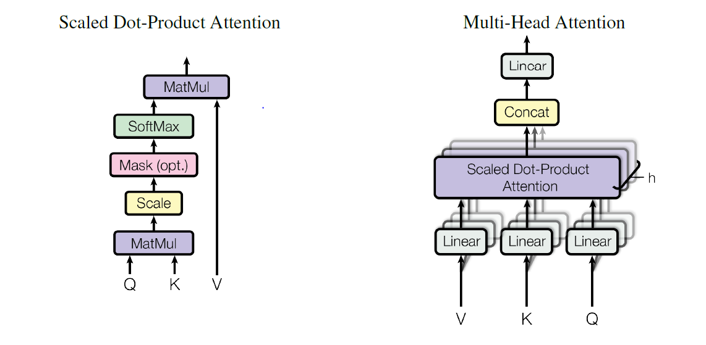

## 题目

Attention Is All You Need

**arXiv:1706.03762**

<https://arxiv.org/abs/1706.03762>

## 研究背景

​		它的应用领域主要是针对序列转导模型，比如机器翻译等。在这片文章提出的时候，主流的模型是基于RNN或CNN的编码解码模型，再加入attention机制。就比如机器翻译这个例子，在当时最先进的方法就是LSTM和GRU，再加入attention机制。

​		在许多任务中，Attention机制已经成为序列建模和转导模型不可或缺的一部分，它可以学习序列中的依赖关系而不用考虑他们在输入或输出序列中的距离。大多数情况下，这些Attention机制都和循环神经网络一起使用。

​		循环模型通常是将输入输出序列的符号位置作为因素计算。通过在计算的时候对齐位置和步骤，他们根据前一步的隐藏层状态ht-1和输入产生位置t的隐藏状态序列ht。这个固有的顺序性质妨碍了训练样本的并行化，这在更长的序列中至关重要，因为内存的约束限制了样本的批次大小。

## 研究动机

​		对于RNN这种序列结构，有些问题，尤其是RNN机制实际中存在长程梯度消失的问题，对于较长的句子，我们很难寄希望于将输入的序列转化为定长的向量而保存所有的有效信息，所以随着所需翻译句子的长度的增加，这种结构的效果会显著下降。

​		为了解决这一由长序列到定长向量转化而造成的信息损失的瓶颈，Attention注意力机制被引入了。Attention机制跟人类翻译文章时候的思路有些类似，即将注意力关注于我们翻译部分对应的上下文。同样的，Attention模型中，当我们翻译当前词语时，我们会寻找源语句中相对应的几个词语，并结合之前的已经翻译的部分作出相应的翻译。

​		RNN由于其顺序结构训练速度常常受到限制，既然Attention模型本身可以看到全局的信息， 那么一个自然的疑问是我们能不能去掉RNN结构，仅仅依赖于Attention模型呢，这样我们可以使训练并行化，同时拥有全局信息？

​		这就是本文提出的模型的动机，并行化训练，提升训练速度。在学习序列中两个词之间的关系时，所需要的操作数量会随这两个词位置间的距离增长，这使学习两个远距离位置之间的依赖更加困难。本文提出的Transformer完全依赖于self-attention来计算输入和输出的表达，而没有使用序列对齐RNN或卷积的模型，将学习依赖的操作数减少到常数，并且用Multi-Head Attention来提升学习效果。

## 解决思路

图一就是Transformer模型的一个示意图，它也是encoder-decoder模型：

* **Encoder:**	编码器由N = 6个完全相同的层堆成。每一层有两个子层。第一个是一个multi-head self-attention机制，第二个是一个简单的，位置完全连接的前馈网络。我们对每个子层再采用残差连接(residual)，接着再进行层标准化。也就是说，每个子层的输出是LayerNorm(x + Sublayer(x))，Sublayer(x)是子层本身实现的函数。为了是残差连接更容易，模型中的所有子层以及embedding层产生的输出维度都是*dmodel* = 512。

* **Decoder:**	解码器也是由N = 6个完全相同的层堆成。除了有编码器每层中的两个子层之外，解码器还加入了第三个子层，该层对编码器堆栈的输出执行multi-head attention。和编码器类似，我们对每个子层采用残差连接，接着进行层标准化。我们还修改了解码器堆栈中的self-attention子层，以防止关注到后面位置。这种掩码(masking)结合将输出嵌入偏移一个位置，确保了预测位置 *i* 只能依赖小于 *i* 位置的已知输出。

 

Figure 1: The Transformer - model architecture.

所谓的Multi-Head Attention就是将多组缩放的点积Attention放在一起。如图二所示：

Figure 2: (left) Scaled Dot-Product Attention. (right) Multi-Head Attention consists of several
attention layers running in parallel.

下面是模型中各个组件的详细介绍：

1. **Scaled Dot-Product Attention**

   ​		输入由queries，*dk* 维的keys和 *dv* 维的values组成。我们计算query和所有keys的点积，接着除以$\sqrt[]{d_k}$ ，然后使用softmax函数去获得values的权重。

   ​		在实践中，我们将一组queries打包成一个矩阵Q，然后并行计算attention函数。同时，将keys和values也打包成矩阵 K 和 V。我们用下面的公式计算这些矩阵的输出：

$$
Attention(Q,K,V) = softmax(\frac{QK^T}{\sqrt[]{d_k}})V
$$

2. **Multi-Head Attention**

   ​		将Q，K，V线性投影到 *dk* ， *dk* 和 *dv* 维，然后并行计算attention函数，产生 *dv* 维输出值。将这些串联并再次投影，得到最终值，就如Figure2的右图。公式如下：
   $$
   \begin{align}MultiHead(Q,K,V) &= Concat(head_1, ...,head_n)W^o \\where\ head_i &= Attention(QW_i^Q,KW_i^K,VW_i^V)\end{align}
   $$

3. **基于位置的前馈网络**

   ​		除了attention子层之外，encoder和decoder的每一层都包含一个全连接前馈网络，独立且相同的应用在每个位置。它由两个线性变换组成，中间有一个ReLU激活。
   $$
   FFN(x) = max(0,xW_1+b_1)W_2+b_2
   $$

4. **位置编码**

   ​		位置编码也是比较重要的一部分，由于Transformer模型不含有循环和卷积，为了使模型利用序列的顺序，文中将这种位置关系加在encoder和decoder栈底端的输入embedding中。位置编码和embedding有相同的维度 dmodel ，所以这两个可以相加。本文使用不同频率的正弦和余弦函数来得到位置编码：
   $$
   \begin{align}
   PE_{(pos,2i)} &= sin(pos/10000^{2i/d_{model}})\\
   PE_{(pos,2i+1)} &= cos(pos/10000^{2i/d_{model}})
   \end{align}
   $$

## 实验过程和结果

* **训练方法**

  1. 训练数据

     机器翻译：标准的WMT 2014英语-德语数据集和WMT 2014英法数据集

  2. 硬件和时间

     硬件：8个NVIDIA P100 GPU

     时间：3.5天

  3. 优化

     Adam优化，参数：$\beta_1$ = 0.9，$\beta_2$ = 0.98，$\epsilon$ = $10^{-9}$。

     学习率：
     $$
     lrate = d_{model}^{-0.5}·min(step\_num^{-0.5},step\_num·warmup\_steps^{-1.5})\\
     warmup\_steps = 4000
     $$

  4. 三种正则化：

     Residual Dropout：在每个子层的输出应用dropout，然后再相加和归一化。此外，在编码和解码堆栈中，将dropout应用在embedding和位置编码加和的地方。$P_{drop}$ = 0.1。

     Label Smoothing：$\epsilon_{ls}$ = 0.1

* **结果**

  

  ​		从表中可以看出 Transformer在英语-德语和英语-法语newstest2014测试中获得的BLEU分数比以前的最新模型的分数更好，且训练成本只是它们的一小部分。

  ​		在WMT 2014英语-德语翻译任务中，大型transformer模型比以前报道的最佳模型（包括整合模型）高出2*.*0个BLEU以上，确立了一个全新的最高BLEU分数为28*.*4。

  ​		在WMT 2014英语-法语翻译任务中，transformer大型模型的BLEU得分为41*.*0，超过了之前发布的所有单一模型，训练成本低于先前最先进模型的1 *∕* 4 。

## 结论

​		本文提出了Transformer，完全基于Attention的序列转导模型，用Multi-Head Attention取代了encoder-decoder中的循环层。减少了生成时的顺序性，能更好地并行训练。

​		对于翻译任务，Transformer比基于RNN和CNN的结构训练更快。在WMT 2014英语-德语和WMT 2014英语-法语的翻译任务中有更好的结果。

​		将Transformer扩展到其他任务也具有可行性。